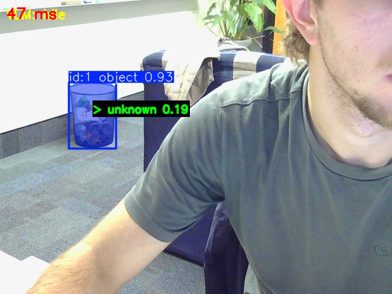
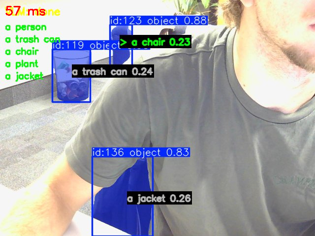
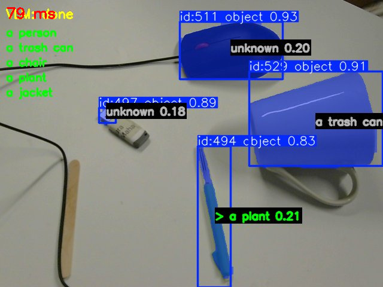
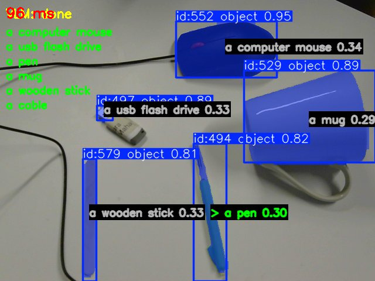

# 🧠 Vision Server — Real-time Segmentation + CLIP + VLM Pipeline

This project is a real-time computer vision server that combines:

* **FastSAM** for object segmentation and tracking
* **CLIP** for visual classification of detected objects
* **VLM (Vision-Language Model)** for dynamic label generation
* A **socket-based streaming system** for real-time video processing

The system receives frames from a client, processes them, and streams back annotated results.

---

# 🚀 Features

* Real-time object segmentation (FastSAM)
* Object classification using CLIP embeddings
* Dynamic label updating using a VLM (prompt-based)
* Central object prioritization
* Socket-based video streaming
* Lightweight overlay visualization (OpenCV)

---

# 📁 Project Structure

```
.
├── server.py              # Main real-time processing server
├── clip_classifier.py     # CLIP-based image classification
├── utils.py               # Image utilities (crop, draw, send)
├── config.py              # Configuration (models, thresholds, ports)
├── vlm.py                 # VLM label generation
├── local.py               # Send the frames
├── labels.json            # Persisted learned labels
├── requirements.txt       # Python dependencies
├── localrequirements.txt  # Local/dev dependencies
```

---

# ⚙️ Installation

## 1. Clone the repository

```bash
git clone https://github.com/YOUR_USERNAME/Vision-Server.git
cd Vision-Server
```

---

## 2. Create virtual environment (recommended 2, one local/client, and one server)

```bash
python -m venv venv
source venv/bin/activate   # Linux / Mac
# or
venv\Scripts\activate      # Windows
```

---

## 3. Install dependencies

```bash
pip install -r requirements.txt #serveur 
```
```bash
pip install -r localrequirements.txt #local/client
```

---

# 🧠 Models Used

* FastSAM (segmentation)
* OpenCLIP (ViT-B-32 / LAION-2B)
* Custom VLM (OpenRouter API or equivalent)

---

# ▶️ How to Run

## 1. Start the server

```bash
python server.py
```

The server will:

* open a TCP socket
* wait for a client connection
* process incoming frames in real time

---

## 2. Start the client (example)

```bash
python local.py
```

This sends webcam frames to the server.

---

# 🌐 Remote Access (Tunnel Setup)

If you want to run the system remotely (e.g. from another machine or phone), use a tunnel.You have to lauch the tunnel before server.py and client.py.


##  SSH tunnel

```bash
ssh -L *****:localhost:***** user@your-server-ip
```

---

# 🧪 How It Works

### 1. Frame reception

Client sends frames via TCP socket.

### 2. Segmentation

FastSAM detects objects and produces masks.

### 3. Cropping

Each object is cropped using mask bounding boxes.

### 4. Classification (CLIP)

Each crop (with a padding crop) is embedded and compared to text labels.

### 5. Central object selection

The object closest to image center is highlighted.

### 6. Visualization

OpenCV overlays:

* labels
* confidence scores
* selected object highlight

---

# 🧠 VLM Mode

Press:

```
l + Enter
```

This will:

* send current frame to VLM
* generate new labels
* update CLIP classifier dynamically

---

# 📸 Results

Add your images here in execution order:

## Step 1 — lauch with random labels



## Step 2 — After generation of new labels 



## Step 3 — new scene with the former labels 



## Step 4 — After generation of new labels



executed on a server equipped with an **NVIDIA RTX A6000** GPU.

---

# ⚠️ Notes

* GPU strongly recommended (FastSAM + CLIP)
* First run may download model weights
* High RAM usage due to segmentation masks
* Avoid sending extremely large frames

---

# 🧱 Possible Improvements

* Replace socket with WebRTC for lower latency
* Add multi-object tracking persistence
* Try new ultralitics models or other segmentation models 
* find the best padding crop

---
